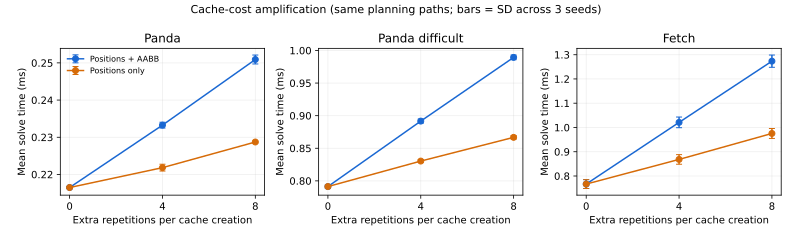

球グループ AABB の perf 計測と生成費用の見積もり（2026-09-27）

調査はここで終了し、実装と計測資料を調査用ブランチに保存する。
AABB 導入による追加の生成処理を無料にした場合でも、AABB なし版に対する改善見込みは
Panda 系ではなく、Fetch で約4.7%に留まる。実装済みの最適化は座標変換も高速化して
Fetch 全体で平均5.2%短縮したが、95%区間は1.8〜7.6%で、確実に5%を超える利益は
確認できなかった。この費用対効果を踏まえ、この AABB 案の追加検討を終了する。

今回の比較対象は、AABB なしの `7574426`、直前の scalar AABB 版 `bc98f85`、
今回の AVX 版。certificate はこの checkout に含まれない。
ここでいう改善率はすべて**実行時間の短縮率**で、throughput の増加率とは異なる。

「AABB の生成が無料ならどれだけ速くなるか」は、追加の境界集約だけが無料なのか、
以前から必要だった球の座標変換も無料なのかで答えが変わる。
生成箇所で仕事を追加反復する実験から、直前の AABB 版に対して次の余地を見積もった。

| ケース | AABB の追加処理だけ無料 | 座標変換を含む生成全体が無料 | perf の生成関数内 cycles 比率 |
| --- | ---: | ---: | ---: |
| Panda | 約1.3% | 約2.0% | 2.52% |
| Panda difficult | 約1.9% | 約3.1% | 4.48% |
| Fetch | 約4.8% | 約8.2% | 9.74% |

これは**現在の生成タイミングと衝突判定順序を維持した場合の推定**で、
あらゆるアルゴリズムに対する厳密な上限ではない。
Panda 系ではこの箇所だけの改善余地は小さく、Fetch の方が効果を期待できる。
また、右端の perf の値は位置計算も含む関数全体の標本比率であり、
AABB 導入によって増えた費用だけを表すものではない。

反復実験は、実際に AABB を生成するたびに同じデータで追加0、4、8回、
キャッシュを dirty にして再計算する。次の2系列を同じ入力で測定した。

- full: 位置と AABB を再生成する。
- positions: 従来の位置計算だけを再実行する。

`T_full(k) = T0 + k * C_full`、`T_positions(k) = T0 + k * C_positions`
として傾きを求め、`C_extra = C_full - C_positions` を追加 AABB 費用とした。
0、4、8が等間隔なので、最小二乗の傾きは `(T(8) - T(0)) / 8` になる。
各反復後の compiler memory barrier により、LTO による計算の除去を防いでいる。
この計測専用の反復処理は本体には入れていない。



seed 501〜503、各プロセス300回 warmup と3,000回計測。
2系列の共通0回、各系列4/8回、元の2ビルドの計7条件を順序を変えて比較した。
全189,000 solve が成功し、対応する経路 SHA-256 と衝突判定回数が一致した。
推定された full / positions / extra の平均費用は、1 solve 当たり
Panda 4.31 / 1.53 / 2.77 µs、difficult 24.77 / 9.43 / 15.33 µs、
Fetch 63.33 / 26.07 / 37.26 µs。
extra の seed 別短縮率はそれぞれ1.22〜1.32%、1.82〜1.99%、4.76〜4.93%。

反復では同じデータと分岐履歴が温まるため、通常の1回分と完全には同じ費用ではない。
perf の標本比率との差も残る。したがって小数点以下まで正確な「無料版の実測値」
としては扱わない。保存した境界を再生する方法も試したが、境界のロード自体に費用が
掛かった。Fetch は8,400 solve 分で約1.24 GBの境界列となり、無料の代理にならない。
その再生時間を上限の根拠には使っていない。

この費用推定と同時に測った AABB なし版を基準にすると、追加 AABB 処理が無料でも
Panda は約1.8%、difficult は約1.4%遅く、Fetch は約4.7%短縮する計算になる。
位置計算も無料なら、それぞれ約1.1%遅い、ほぼ同等、約8.0%短縮。
比較・分岐・dirty flag の管理などは無料化されないため、生成費用がゼロでも
必ず AABB なしを上回るわけではない。これも別 cohort の測定を使った推定であり、
後述の最終版の時間から直接差し引ける厳密な上限ではない。

実装では、xyz を AVX の3 lane にまとめ、座標変換・位置保存・境界集約を同じループで
行う。混在半径なら各球の半径を使い、共通半径なら中心を集約した後で1回拡張する。
`-ffast-math` や全体への `-mavx` は追加していない。x86-64 の GCC / Clang で
実行時に AVX を検出し、対応していない環境では元の scalar 処理を使う。

AVX 化だけでは十分ではなかった。逆アセンブルすると、intrinsic の位置保存後に
Eigen の data pointer と size を毎回再読込していた。コンパイラが保存先と Eigen の
管理情報との alias を排除できず、ループに依存関係のあるロードが残っていた。
位置・相対位置・半径の pointer と球数をループ前のローカル変数へ移すことで除去した。
`restrict` を追加した版には利点がなく、採用していない。
これは「毎回 DRAM から取り直していた」という意味ではない。
同じループで計算するという着眼点に加え、生成された機械語で再読込をなくすことが効いた。

姿勢変更で同時にリセットする4個の dirty / valid flag も隣接させた。
このビルドでは `SphereGroup` は312から296 byteになった。
浮動小数点の積和順序はこのビルドの既存 Eigen 計算に合わせ、3成分だけを保存する。
NaN / Inf の検出、有限値の overflow 時の保守的な fallback、境界の外向き丸めを維持した。

単体測定は [bench_sphere_group_cache.cpp](../../bench/bench_sphere_group_cache.cpp)。
既に得られたリンク姿勢から、位置と AABB を毎回再生成する時間。
1 pass は `20,000,000 / 球数` 回、warmup 1 pass と計測5 pass の中央値。
FK 本体と障害物との比較は含まない。全版を同じベンチソースで再ビルドした。

| 半径 | 球数 | 直前 scalar ns | AVX・再読込あり ns | 最終版 ns | scalar 比の短縮 |
| --- | ---: | ---: | ---: | ---: | ---: |
| 混在 | 8 | 27.85 | 21.99 | 12.30 | 55.8% |
| 混在 | 16 | 50.63 | 40.32 | 21.38 | 57.8% |
| 混在 | 128 | 370.75 | 300.80 | 134.23 | 63.8% |
| 共通 | 8 | 24.54 | 22.44 | 11.00 | 55.2% |
| 共通 | 16 | 45.37 | 40.98 | 19.25 | 57.6% |
| 共通 | 128 | 340.13 | 303.01 | 109.07 | 67.9% |

`example/bench` の3ケースの結果:

| ケース | AABB なし ms | 直前 scalar ms | 最終版 ms | scalar 比 | AABB なし比 |
| --- | ---: | ---: | ---: | ---: | ---: |
| Panda | 0.21956 | 0.22323 | 0.22146 | −0.80% | +0.86% |
| Panda difficult | 0.78989 | 0.82370 | 0.81376 | −1.21% | +3.02% |
| Fetch | 0.79409 | 0.80967 | 0.75280 | −7.02% | −5.20% |

最終候補を選んだ後、未使用の seed 601〜606で確認した。
各 seed・各ビルドで300回 warmup、8,400回計測し、各ケース・各ビルド50,400 solve。
3版の実行順序は6通りの順列を1回ずつ使用した。
全453,600 solve が成功。151,200組すべてで3版の経路 SHA-256 と衝突判定回数が一致した。
外れ値は除外していない。

6 seed を対応づけたまま block 単位で20,000回 bootstrap した平均時間比の95%区間:

| ケース | 最終版 / scalar の時間変化 | 最終版 / AABB なしの時間変化 |
| --- | ---: | ---: |
| Panda | −2.59〜+1.58% | −0.78〜+3.02% |
| Panda difficult | −4.48〜+2.45% | −0.67〜+7.88% |
| Fetch | **−8.85〜−4.40%** | **−7.61〜−1.83%** |

Fetch は6 seed すべてで scalar より速く、AABB なしにも5 seed で勝った。
Panda 系は両区間が0をまたぐため、平均の小さな改善・悪化を確定的には扱わない。
特に difficult の seed 602には大きな揺れがあり、単一プロセス内の solve を増やすだけでは
消えない。今回の50,400件は独立した50,400回の実行環境の反復を意味しない。

同じ測定ループでの hardware counter の変化:

| ケース | cycles / scalar | 命令数 / scalar | cycles / AABB なし | 命令数 / AABB なし |
| --- | ---: | ---: | ---: | ---: |
| Panda | −0.71% | −1.76% | +0.69% | −0.34% |
| Panda difficult | −1.20% | −2.89% | +3.02% | −0.55% |
| Fetch | −7.14% | −6.80% | −5.22% | −9.12% |

counter は全イベントで100% running、multiplex はなし。
Fetch の時間改善は cycles と命令数の減少でも確認できた。
座標変換自体の改善と flag 配置の変更も含むため、今回の改善を
追加 AABB 集約だけの無料化に相当すると考えることはできない。

最終版を同じ seed 511・10,000 solve で再 profile すると、生成関数と AVX kernel の
cycles 標本比率の合計は Panda 1.30%、difficult 2.06%、Fetch 7.53%だった。
この値も位置計算を含み、追加 AABB 費用だけの残量ではない。
また、8球の単体ベンチを `perf stat` で確認すると、scalar 比で混在半径は
cycles 55.9%・命令数61.9%、共通半径は cycles 54.9%・命令数59.4%減少した。
単体 counter は warmup を含む全6 pass とプロセス起動部分を含む。
本体の CMake ビルド、計画比較用バイナリ、symbol を残した profile 用バイナリの
`.text` が一致することも確認した。

測定条件は AMD Ryzen 7 7840HS、CPU 2 固定、turbo 有効、governor ondemand、
GCC 9.4、Release `-O3 -DNDEBUG -flto`、`EIGEN_DONT_VECTORIZE`、
`EIGEN_NO_DEBUG`、Python 3.8.10、nanobind 2.9.2、OMPL 1.6。
`OPENBLAS_NUM_THREADS=1`、`OMP_NUM_THREADS=1`。
RRTConnect、range 2.0、refinement なし、Box validator 幅0.05。
ビルド・テストを同時実行せず、3ビルドを順次計測した。

`perf stat` は FIFO 制御で warmup 終了時に開始し、最後の測定後に停止した。
import、シーン構築、warmup、JSON 出力は counter に含まない。
計測ループ内の Python 呼出し・経路の hash 計算は含むため、C++ 内部時間そのものとは
異なる。wall 時間は従来と同じ `OMPLSolverResult.time_elapsed` を使う。
profile も同じ方法で開始・停止し、`cycles:u`、3,999 Hzでサンプリングした。

全 Python テストは最終 AVX 版で **144 passed**。AVX 経路を無効化してビルドした
scalar fallback でも **144 passed**。
単体 `verify` では球数1、2、3、4、7、8、9、16、17、128、共通・混在半径、
ランダム姿勢の計20,000条件について、従来の位置計算とその位置から求めた境界に
対する完全一致を確認した。非有限値や丸め境界は既存の AABB 回帰テストで確認した。
これは検査した入力とビルドでの一致であり、全入力に対する証明ではない。

ローカルの箱を回転して保守的な境界を作る方法、axis ごとの遅延生成、位置と境界の
2 pass 化も試したが、安定した全体改善がなかったため採用しなかった。

perf 測定の再実行例（FIFO は最初に1回作成する）:

```bash
mkdir -p .cache/aabb/recheck
mkfifo .cache/aabb/recheck/control .cache/aabb/recheck/ack
OPENBLAS_NUM_THREADS=1 OMP_NUM_THREADS=1 perf stat -D -1 \
  --control fifo:.cache/aabb/recheck/control,.cache/aabb/recheck/ack \
  -e cycles:u,instructions:u,branches:u,branch-misses:u \
  -- .venv/bin/python example/bench/compare_aabb.py \
  --module .cache/aabb/build/_plainmp.cpython-38-x86_64-linux-gnu.so \
  --case fetch --samples 8400 --warmup 300 --seed 601 --cpu 2 \
  --perf-control .cache/aabb/recheck/control --perf-ack .cache/aabb/recheck/ack \
  --output .cache/aabb/recheck/fetch.json
```

費用推定用モジュールは [build_aabb_cost_probe.py](../../bench/build_aabb_cost_probe.py) で
作成できる。既存の Release CMake ビルド、Unix Makefiles、
`CMAKE_EXPORT_COMPILE_COMMANDS=ON` が必要。

```bash
.venv/bin/python bench/build_aabb_cost_probe.py \
  --build-dir .cache/aabb/build --output-dir .cache/aabb/recheck/probe --ref bc98f85
```

このモジュールを `--module` に指定し、環境変数 `PLAINMP_COST_REPETITIONS=0/4/8`、
`PLAINMP_COST_POSITIONS_ONLY=0/1` を切り替えて別プロセスで計測する。
元の revision のヘッダを使い、依存する翻訳単位も再ビルドするため、
新旧 `SphereGroup` の配置を混在させない。

集計値・各 seed・単体測定全 pass・バイナリ hash は
[aabb_cache_perf.json](aabb_cache_perf.json) に保存した。
全 solve の生データは `.cache/aabb/perf/selected/`、
費用推定は `.cache/aabb/perf/cost_model/`、
一括実行は `.cache/aabb/perf/run_selected.py` と `run_cost_probe.py`。
途中の候補・逆アセンブル・profile は `.cache/aabb/perf/` に保存した。
`.cache` 内は Git 管理対象外。インストール済みの拡張モジュールは変更していない。
